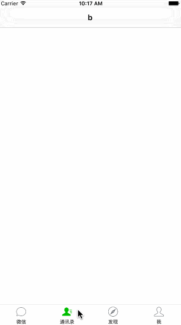

# wetab



## 用法

```
- (void)initRootViewController {
    WeTabBarController *WetabBarController = [WeTabBarController sharedWeTabBarController];
    
    // a
    UINavigationController * stockRoom = [self getNavigationControllerFrom:@"a"];
    // b
    UINavigationController * contact = [self getNavigationControllerFrom:@"b"];
    // c
    UINavigationController * financial = [self getNavigationControllerFrom:@"c"];
    // d
    UINavigationController * mine = [self getNavigationControllerFrom:@"d"];;
    
    NSArray * array = @[stockRoom, contact, financial, mine];
    
    
    WeTabBarItem * chatItem = [WeTabBarItem initWithTitle:@"微信"
                                                      image:[UIImage imageNamed:@"tabbar_mainframe"]
                                              selectedImage:[UIImage imageNamed:@"tabbar_mainframeHL"]];
    
    WeTabBarItem * contactsItem = [WeTabBarItem initWithTitle:@"通讯录"
                                                          image:[UIImage imageNamed:@"tabbar_contacts"]
                                                  selectedImage:[UIImage imageNamed:@"tabbar_contactsHL"]];
    
    WeTabBarItem * discoverItem = [WeTabBarItem initWithTitle:@"发现"
                                                          image:[UIImage imageNamed:@"tabbar_discover"]
                                                  selectedImage:[UIImage imageNamed:@"tabbar_discoverHL"]];
    
    WeTabBarItem *mineItem = [WeTabBarItem initWithTitle:@"我"
                                                     image:[UIImage imageNamed:@"tabbar_me"]
                                             selectedImage:[UIImage imageNamed:@"tabbar_meHL"]];
    
    WeTabBar *tabBar = [[WeTabBar alloc] initWithFrame:CGRectMake(0, SCREEN_HEIGHT-49, SCREEN_WIDTH, 49)];
    tabBar.tag  = 10000;
    tabBar.tabBarItems = @[chatItem, contactsItem, discoverItem, mineItem];
    
    // 是否显示tabbar上边沿线
    tabBar.showTopline = YES;
    
    // 是否允许scroll
    WetabBarController.enableScroll = YES;
    
    WetabBarController.tabBar = tabBar;
    WetabBarController.viewControllers = array;
    
    self.window.rootViewController = [WeTabBarController sharedWeTabBarController];
}
```
##  配置项

### 显示tab上边缘线

```
tabBar.showTopline = YES;
```

### tab项之间左右滑动 

```
wetabBarController.enableScroll = YES;
```

### 显示隐藏单例方法

```
- (void)viewWillAppear:(BOOL)animated{
    [[WeTabBarController sharedWeTabBarController] show];
}
```

or

```
[[WeTabBarController sharedWeTabBarController] hide];
```
